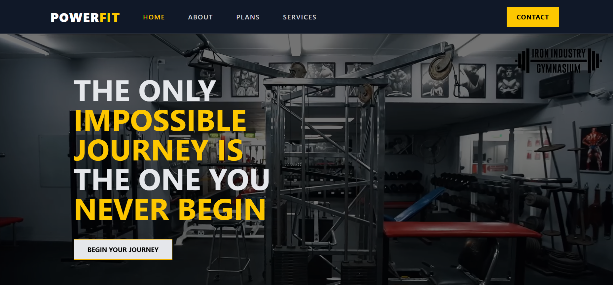
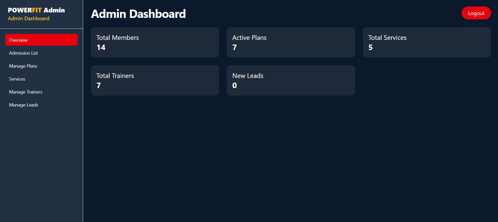
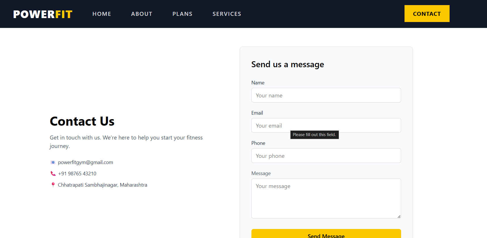

# React + Vite

# 💪 FitZone – Modern Gym Web Application

FitZone is a modern **Gym Landing Page Web Application** built using the **MERN Stack**.  
It provides an interactive platform where users can explore gym services, trainers, membership plans, and contact the gym easily.

The project also includes an **Admin Dashboard** where the admin can manage leads, plans, trainers, and services.

---

# 🚀 Live Demo

🔗 https://digitos-first-task.vercel.app

---

# 🛠 Tech Stack

### Frontend
- React.js
- Tailwind CSS
- Framer Motion

### Backend
- Node.js
- Express.js

### Database
- MongoDB

---

# 📂 Project Structure

```
src
 ├── api
 ├── assets
 ├── components
 │   ├── admin
 │   ├── plans
 │   ├── Hero.jsx
 │   ├── Services.jsx
 │   ├── TrainerSection.jsx
 │   ├── ContactForm.jsx
 │   └── Footer.jsx
 │
 ├── context
 │   └── AdminAuthContext.jsx
 │
 ├── data
 │   └── services.js
 │
 ├── pages
 │   ├── Home.jsx
 │   ├── About.jsx
 │   ├── Plans.jsx
 │   ├── ServicesPage.jsx
 │   ├── ServiceDetail.jsx
 │   ├── Contact.jsx
 │   ├── AdminLogin.jsx
 │   └── AdminDashboard.jsx
 │
 ├── App.jsx
 ├── main.jsx
 └── index.css
```

---

# ✨ Features

### User Side
- Modern Gym Landing Page
- Responsive UI
- Gym Services Section
- Trainer Section
- Membership Plans
- Contact Form
- Smooth Animations (Framer Motion)

### Admin Dashboard
- Admin Login Authentication
- Manage Leads
- Manage Plans
- Manage Services
- Manage Trainers
- Edit & Delete Data

---

# 📸 Screenshots

### Home Page



### Admin Dashboard



### Contact Page



---

# ⚙️ Installation

### Clone the repository

```
git clone https://github.com/prajwaltijar/Gym_frontend.git
```

### Install dependencies

```
npm install
```

### Run the project

```
npm run dev
```

---

# 👨‍💻 Author

**Prajwal Tijare**

GitHub  
https://github.com/prajwaltijar

---

# 📜 License

This project is created for **learning and educational purposes**.
